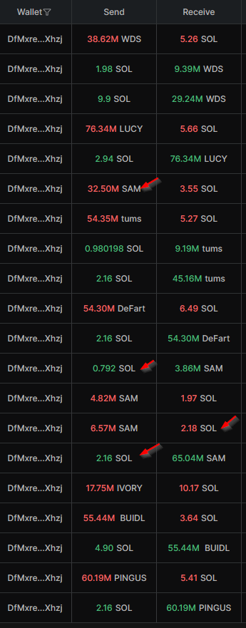
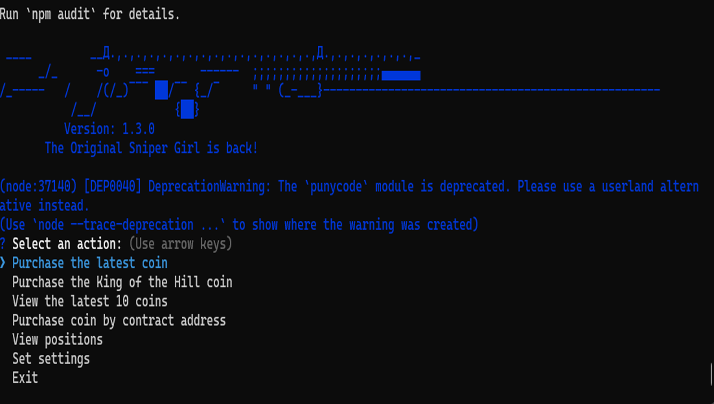
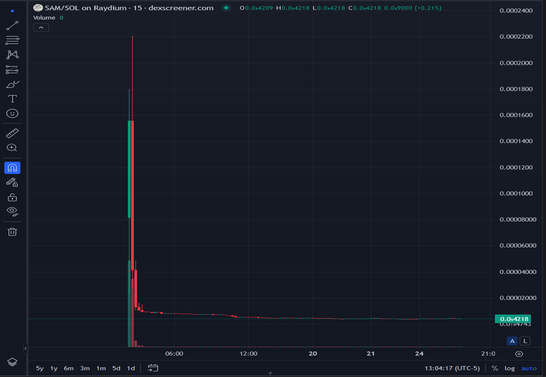
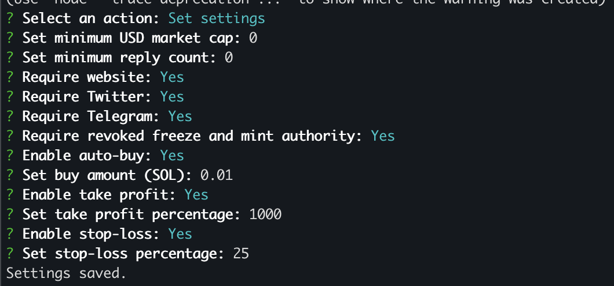
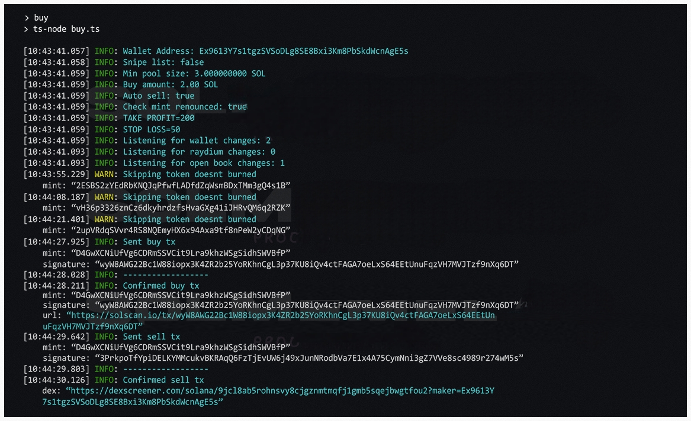

## Sniper Girl: Deny, Defend, Depose sniping Bot – Fast Open Source Automated Trading Bot
Sniper Girl is a Bot for automated trading on Pump.fun and Dex Screener and Dex Screener tokens. Designed to excel on the Solana blockchain, Sniper Girl detects new liquidity pools, executes trades with precision, and optimizes profits using customizable settings. 


**Initial Buy:** The bot watches Pump.fun and Dex Screener to identify new token pairs with favorable bonding curves to make profit.

**Monitoring:** Once a token is bought, the bot monitors the market cap and bonding curve progress sells at the right time. See the dashboard that will be released soon Still buggy right now



---

## Why Choose Sniper Girl Bot?

**The Sniper Girl Story:** I am a Jr dev and sniper girl was originally created to help pay for a family members insulin. I released on Github before with it tied to my Discord but kept getting blown up because people weren't ready to invest more than $50, so I closed the account. Recently Luigi inspired me to to rerelease this code. A friend of mine pooled money together with his sister and cousin. They split the cost and profits.

**Low fees** 
Low fee of .005 SOL every time you run the bot, not every transaction ~.10 cents
With fees from the Solana Block chin and fees from Pump Fun and Dex Screener having less than $100 in your wallet will lead to failure. I recommend at least 1-5 Sol.

**Lightning-Fast Execution**: Outperform competitors with advanced liquidity pool detection and trade execution.

**Customizable Strategies**: Tailor profit-taking and stop-loss thresholds to align with your trading goals.

**Beginner-Friendly Setup**: Quick and simple installation for users new to automated trading.

**Advanced Analytics**: Bonding curve monitoring and market cap analysis for expert-level insights.


**Community-Driven Development**: An open-source model ensures transparency, regular updates, and ongoing improvements from the community.


Sniper Girl is optimized to reduce risks while helping traders capitalize on Pump.fun and Dex Screener token opportunities.





---


# Key Features:

**Win Rate:**
83% with fast internet after running for a month

**Profit Targets:** The bot aims to take profit at a 25% increase and then again at another 25% increase. It sells 50% of the tokens at the first 25% increase and 75% of the remaining tokens at the next 25% increase. 

**Stop Loss:** The bot will sell all tokens if the market cap falls by 10% of your highest take profit.

**Bonding Curve:** The bot will sell 75% of the tokens if the bonding curve reaches a critical level and keeps 25% as a moon bag just in case it rebounds, that way you can make more money.

**Timing:** The bot resets the timer if the price goes up and monitors the trade for a set period, adjusting its actions based on market conditions.

**Example Snipe**
Here you will see when the bot sniped the SAM token on Dex Screener.
The dashboard isnt ready to be released yet but as you can see where the arrows are pointed,
green is buy and red is sell. 


SAM buy 2.16 SOl for SAM 65M
SAM sold 6.57M for 2.18 SOL # Instant return on investment selling a fraction of the tokens
SAM sold 4.82M for 1.97 SOL # More profit
SAM buy 0.792 SOL for 3.86M # Small buy in to keep the price going up
Sam sold 35.5M for 3.55 SOL 
Investment 2.16 SOL ~$400  Return 6.6 SOl ~$1200+ in around 7 minutes
---


## Why Sniper Girl is Open Source

Sniper Girl is open-source because we believe in building tools for the community, by the community. Here’s why:

1. Even the playing felid: Unless you come from a wealthy background you are most likely 
living paycheck to pay check.

2. Getting bills paid: Wile it may not make you a millionaire over night, it will easily push you into six figures in a year.

3. Rules for thee: As you know we aren't living by the same rules the elite are, Time to bend them in our favor


Your feedback, contributions, and testing are invaluable to improving Solana trading automation.


---

# Installation

## 1. Prerequisites
1. The settings have been pre defined to get you started with safe settings.
        auto: true, # auto buy and sell
        buyAmount: 0.1,
        takeProfitEnabled: true, # Take Profit
        takeProfitPercentage: 25,
        stopLossEnabled: true,  # Stop Loss
        stopLossPercentage: 10,
        min_usd_market_cap: 5,
        min_reply_count: 0,
        require_website: false, 
        require_twitter: true,  # Needs a twitter page
        require_telegram: false,
        require_revoked_authority: true # Prevents freezed tokens and rug pulls

   
2. FAST internet or a ubuntu node on AWS ping times to google.com should be under 10ms. I have a node on AWS that runs about $90 a month. I didn't see a reason to upgrade to anything faster.

3. Wallet: A Solana-compatible wallet (e.g., Phantom, Solflare) with SOL, USDC, or WSOL. 1+ SOL recommended. 

4. Node.js: JavaScript runtime built on Chrome's V8 JavaScript engine.

5. SOL Balance: The ratio we suggest is 1:10, that is, for every 1 SOL you'll use per trade, have 10 SOL in the wallet (so if you're using 0.1 SOL per trade to start off, have 1 SOL in wallet. Just make sure you have more SOL for Faster Snipes)


---


## 2. Easy Install for Win, Mac or Linux
Git https://git-scm.com/downloads
Nodejs https://nodejs.org/en/download/package-manager

1. Clone the repository:
```git clone https://github.com/SniperGirl0/Sniper-Girl-Solana-Sniper```


2. Navigate to the bot directory:
```cd Sniper-Girl-Solana-Sniper```

3. Install dependencies:
```npm install```

4. Configure Wallet & RPCs:
```Open SniperGirl.js file & configure your Wallet and RPC URL in appropriate fields. Lines 18 and 19```
----
const PRIVATE_KEY = 'Your private key here.';
const CUSTOM_RPC_URL = 'Your RPC API URL goes here. https://shyft.to/ recommended';
----

5. Start the bot:
```npm run start```

6. Enjoy Profits

7. Errors: The `punycode` module is deprecated. can be ignored. It still works.

---


## Main Commands

**Start Trading:**
npm start

**Stop Trading:**
ctrl + c






---


## How to Contribute

Sniper Girl thrives on community collaboration. Here’s how you can help:
Report Issues: Found a bug or have suggestions? Share them in the issues tab.
Submit Code: Developers can fork the repository and enhance Sniper Girl through pull requests.
Spread the Word: Share Sniper Girl with fellow traders and developers to grow the community.
Every contribution helps improve Solana automated trading tools.


---

Keywords

Solana | Pump Fun Trading Bot | Automated Token Sniper | Solana Liquidity Sniper | Free Solana Trading Bot | Pump.fun and Dex Screener Sniper Bot | Solana Blockchain Trading Tool | Token Sniping Bot | Profit Automation Solana | Pump Fun Sniping Bot | Solana Sniper | Solana AI


---

Disclaimer

Cryptocurrency trading involves significant risk. Use Sniper Girl responsibly and only trade what you can afford to lose. This bot is provided as-is, with no guarantees of profitability. Always conduct your own research before trading.
"# Sniper-Girl-Solana-Sniper" 
